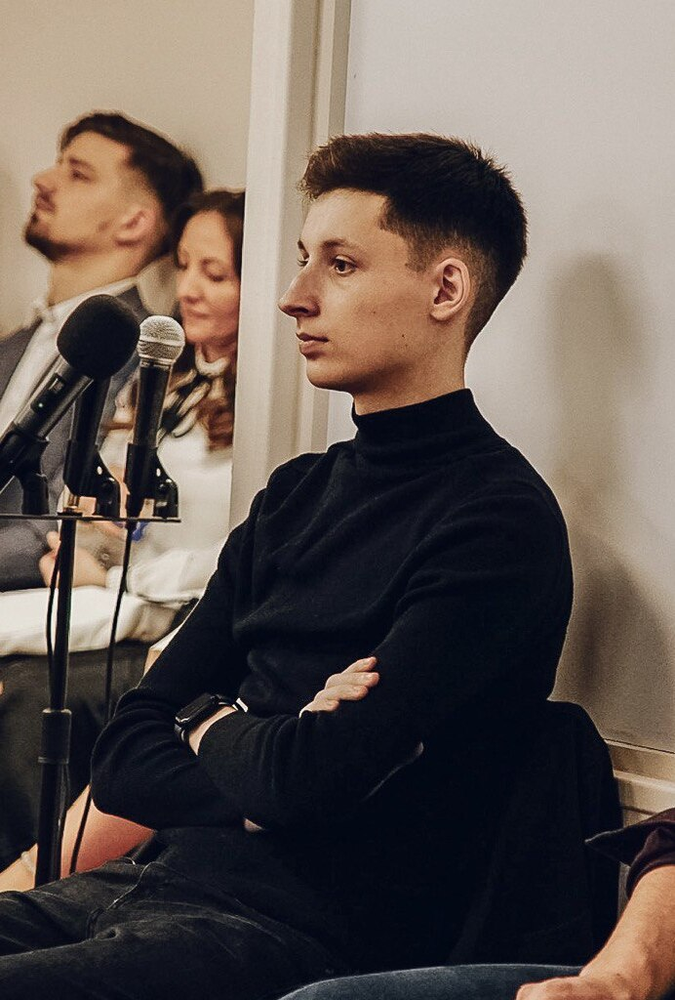
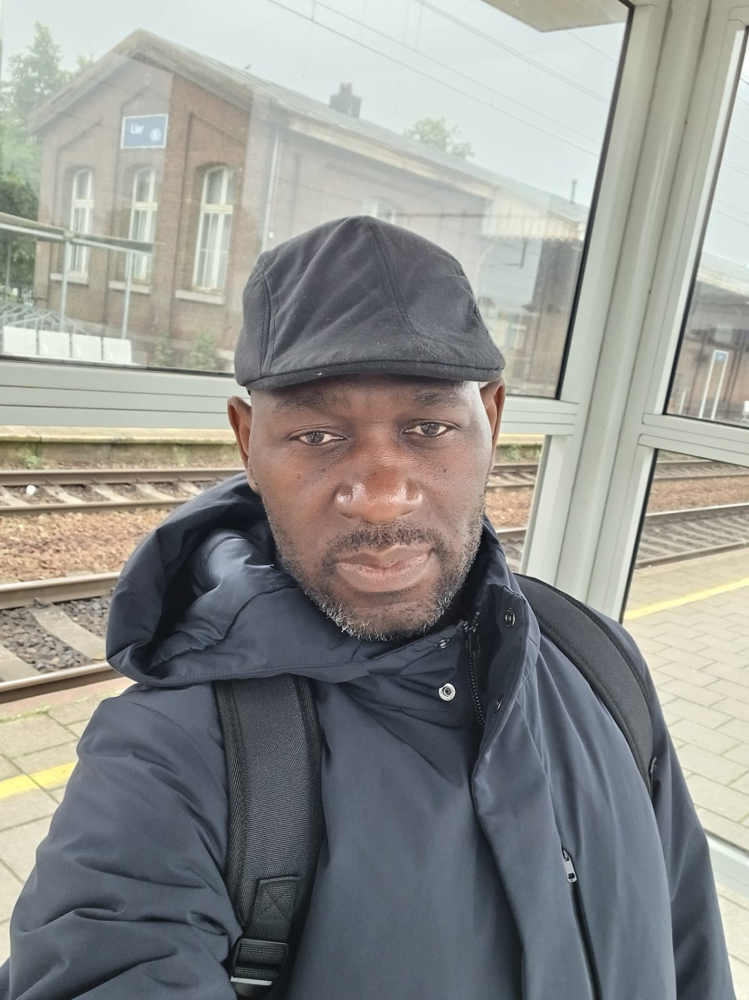
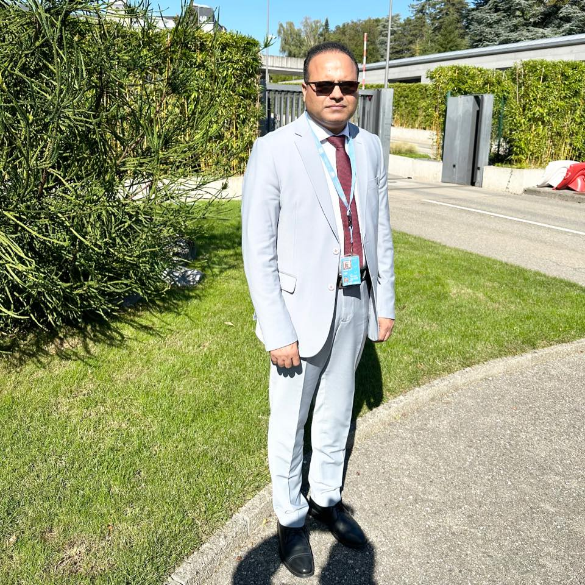

# Group 2 Introduction

Hello! Welcome to our group! We are **group 2** at *Hack Your Future*👋

We are a diverse group of individuals, each with unique backgrounds and
experiences, coming together with a shared interest in coding. Whether you are
here to learn, share knowledge, or connect with others, we hope you feel
welcomed and supported.

## About Us

- **Name**: Group 2
- **Members**: 4
- **Focus**: Front-end Programming
- **Location**: Epitech

## Group Goals

- Foster a collaborative environment where everyone can share their ideas and
  expertise.
- Encourage active participation and respectful discussions.
- Provide resources, tools, and opportunities to help each member grow.
- Create lasting connections through shared interests.

## Member Introduction

| [Catherine Lin](./members/catherine-info.md)  | [Mykytiuk Daniiel](./members/daniel-info.md) | [Harley Clair](./members/harley-info.md)     | [Sajid Hussain](./members/sajid-info.md)     |
| :---: | :---: | :---: | :---: |
|   |   |     |      |

We look forward to learning and growing together. 🚀

Feel free to reach out if you have any questions.
